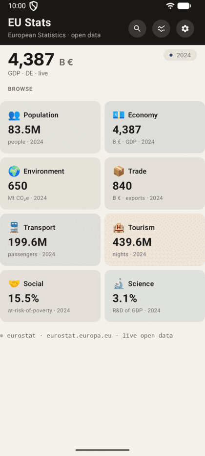
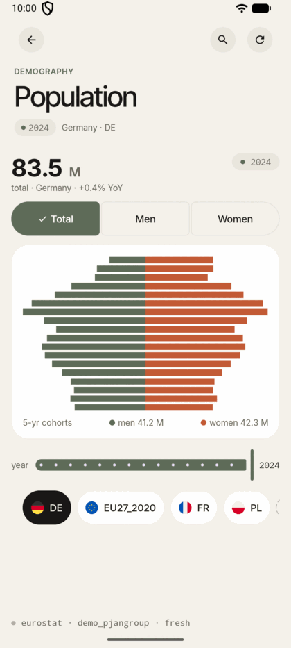
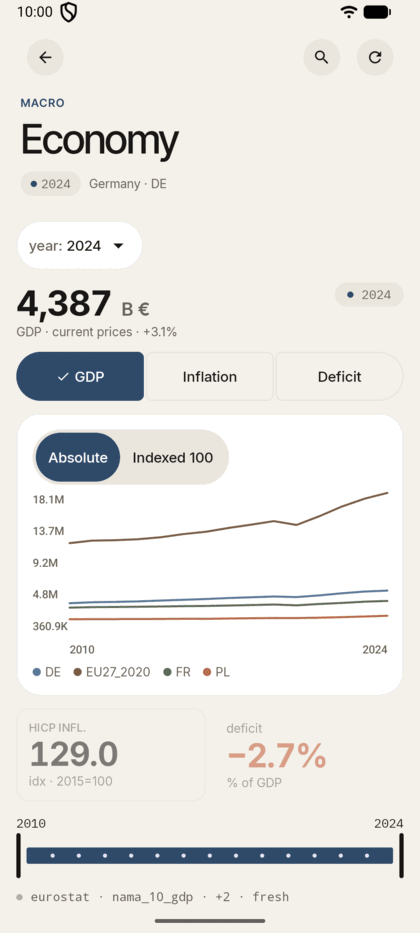
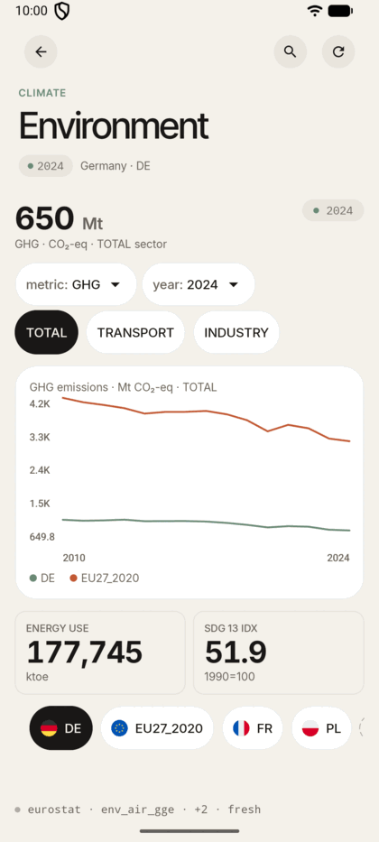
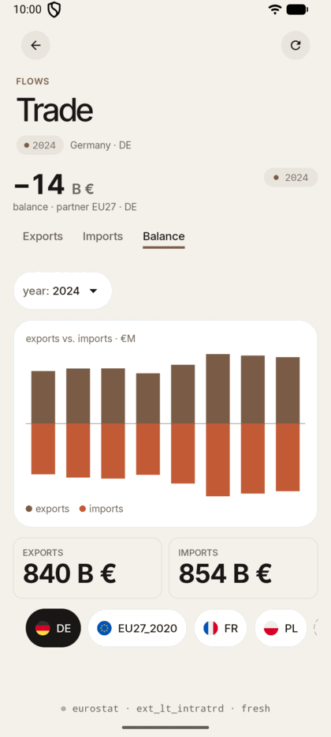
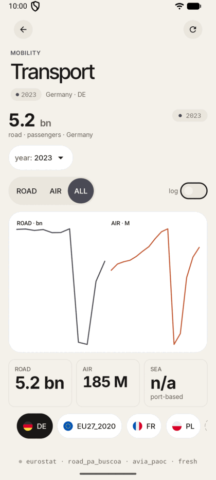
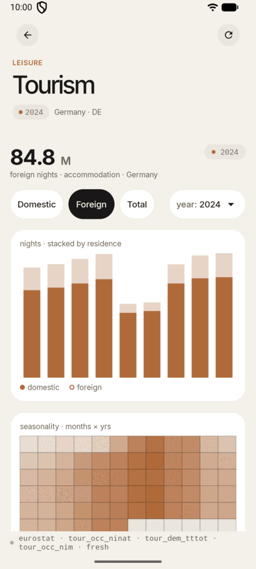
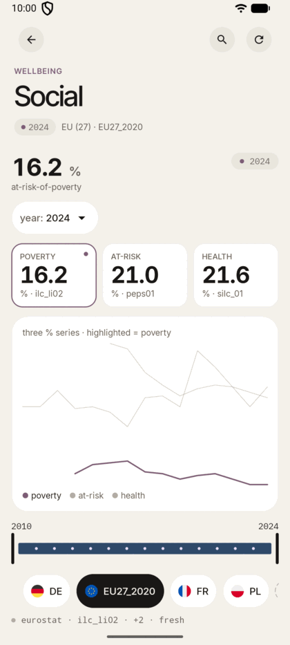
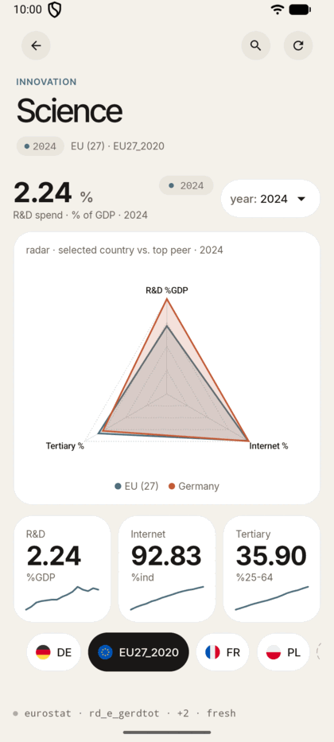

# EU Stats Multiplatform

[](LICENSE)
[](https://github.com/RomanTsisyk/MyEuroStatApp/actions/workflows/build.yml)
[](https://github.com/RomanTsisyk/MyEuroStatApp/releases)
[](https://kotlinlang.org/docs/multiplatform.html)
[](docs/FDROID.md)

Kotlin Multiplatform app (Android · iOS · JVM desktop on macOS / Linux / Windows) that visualizes European statistical data from the official Eurostat public API. Eight thematic modules — economy, population, environment, trade, transport, tourism, social, science — each with its own dataset, switcher pattern, and signature chart.

> **Disclaimer.** This is an independent, third-party open-source mobile client for the public Eurostat HTTP API. It is **not** affiliated with, endorsed by, or sponsored by Eurostat, the European Statistical Office, or the European Commission. The name "Eurostat" appears throughout this project solely to reference the public data source. The app is published under the AGPL-3.0 license and the underlying data is published by Eurostat under Creative Commons Attribution 4.0.

**Phone · tablet · desktop** — single codebase, three form factors. Android handles phone + tablet via responsive layouts; iOS does iPhone + iPad; the JVM/Compose Desktop target packages a self-contained `.jar` (~99 MB) that runs on macOS/Linux/Windows.

**Status:** v0.4.0 · Phase 4 complete · all 8 modules wired end-to-end to real public-API data · Android APK assembles, installs and ships with an adaptive launcher icon plus English/Polish/Ukrainian app strings · **iOS app builds and launches on the iPhone 17 simulator, rendering live Eurostat data**, via a real XcodeGen-generated Xcode project (see [iosApp/README.md](iosApp/README.md)).

**Known limitations:** iOS has not yet been verified on a physical device or shipped via TestFlight; native desktop installers (`.dmg`/`.msi`/`.deb`) are configured and `.dmg` is verified locally, but they are unsigned and not yet published via CI. See [CHANGELOG.md](CHANGELOG.md) and [NEXT_STEPS.md](NEXT_STEPS.md) for the full picture.

See [`CLAUDE.md`](CLAUDE.md) for the project conventions and the Eurostat dataset/filter table, and [`NEXT_STEPS.md`](NEXT_STEPS.md) for the prioritized roadmap.

**License:** AGPL-3.0-or-later (see [LICENSE](LICENSE)).

---

## Screens & demos

Eight thematic modules, one app, real public-API data — open any tab, pick a country, scrub a year.



### Population



A demographic pyramid for 18 age cohorts (five-year bands, Y_LT5 through Y_GE85) from the `demo_pjangroup` dataset. The headline shows total population with year-over-year change. A three-option segmented control (Total / Men / Women) dims the opposite side of the pyramid when a single sex is selected. A year slider scrubs through the available observation years; a country chips row switches the active country without re-fetching. A "+" chip opens a searchable country picker to add more countries to the local cache.

### Economy



Three macro indicators — GDP in current prices (billion EUR, `nama_10_gdp`), HICP inflation index (2015 = 100, `prc_hicp_aind`), and government net lending/borrowing as % of GDP (`gov_10dd_edpt1`) — displayed as a multi-country line chart. A segmented control (GDP / Inflation / Deficit) switches the active metric; the two inactive metrics remain visible as dimmed secondary stat tiles. A dual-handle year scrubber trims the chart's x-range; a separate year dropdown picks the year used by the headline and stat tiles. Country chips and a country picker control which series appear on the chart.

### Environment



Three climate datasets selectable via a dropdown (GHG / Energy / SDG): greenhouse gas emissions in Mt CO₂-eq (`env_air_gge`), final energy consumption in ktoe (`nrg_bal_c`), and the SDG 13 climate index at 1990 = 100 (`sdg_13_10`). When GHG or Energy is active, a chip row filters by sector (TOTAL / TRANSPORT / INDUSTRY). A year dropdown next to the metric dropdown picks which year the headline reports; the chart keeps the full history. The hero is a line chart comparing the active country against one peer; two secondary stat tiles show the other two metrics' values for the same year. A country chips row and picker control the comparison set.

### Trade



Intra-EU goods trade flows from `ext_lt_intratrd` — exports, imports, and trade balance in billion EUR. The hero is a diverging bar chart spanning the eight most recent years, with exports extending to the right and imports to the left. Three underline tabs (Exports / Imports / Balance) highlight the relevant direction. A year dropdown picks the year shown in the headline and stat tiles. Two compact stat tiles show the active country's exports and imports figures for that year. Country chips switch the active country; the "+" picker adds more.

### Transport



Road and air passenger volumes presented as small-multiple line charts side by side. Road data (billion passengers, `road_pa_buscoa`) and air data (million passengers, `avia_paoc`) are independently scaled per panel. A pill toggle (ROAD / AIR / ALL) controls which panels are visible. A log-scale switch on the same row compresses the axis for countries with very different magnitudes. A year dropdown picks the year for the headline and stat tiles; because road and air datasets have different latest years, the dropdown lists the union — picking a road-only year shows "—" in the air tile, and vice versa. Three stat tiles summarise road, air, and a "sea: n/a" tile that explains the port-keyed dataset is intentionally excluded. Country chips switch the active country.

### Tourism



Accommodation overnight stays from `tour_occ_ninat` — domestic, foreign, and total nights — rendered as a stacked bar chart covering the nine most recent years. A chip row (Domestic / Foreign / Total) controls which metric drives the headline figure; a year dropdown next to it picks the year. Below the stacked bars, a monthly seasonality heatmap (cells = month × year) shows the distribution of nights through the calendar using `tour_occ_nim` data; the heatmap is independent of the headline year and always shows the five-year window. A shape-preserving placeholder is shown while data loads. Country chips and a picker switch the active country.

### Social



Three welfare percentage indicators drawn from EU-SILC surveys: at-risk-of-poverty rate (`ilc_li02`), at-risk-of-poverty-or-social-exclusion rate (`ilc_peps01n`), and share of population reporting very-good self-perceived health (`hlth_silc_01`). All three are plotted together as a multi-line highlighted chart; tapping a KPI tile (poverty / at-risk / health) shifts the emphasis to that series and updates the headline value. A year scrubber trims the chart's x-range; a separate year dropdown picks the year used by the headline and KPI tiles. Country chips and a picker switch the active country.

### Science



Three innovation indicators — R&D expenditure as % of GDP (`rd_e_gerdtot`), internet usage rate (`isoc_ci_ifp_iu`), and tertiary education attainment among 25–64 year-olds (`edat_lfse_03`) — shown simultaneously on a radar chart. The radar overlays the active country against a single peer (preferring DE, then FR, then EU27). A year dropdown picks the year drawn by the radar; the three sparklines beneath always show the full trend. There is no metric switcher; the radar presents all three axes at once. Country chips switch the active country.

---

### What it does

| Capability | Status | Where |
|---|---|---|
| Real Eurostat data — all 8 modules | done | `feature-*/src/.../data/` — live API calls, no hardcoded mocks (tourism seasonality heatmap uses live `tour_occ_nim` data) |
| Stale-while-revalidate caching | done | `core-database/` + repository contract in `CLAUDE.md` |
| Offline support (cached data survives no-network) | done | `StaleBanner` in `core-ui/component/` + stale-while-revalidate in every repository |
| Country chips row — switch active country without re-fetch | done | `CountryChipsRow` in `core-ui/component/` |
| Searchable country picker — add countries to session | done | `CountryPickerSheet` in `core-ui/component/` |
| Year scrubber / slider — trim or scrub time range | done | `YearScrubber` (range) + `Slider` (Population) in `core-ui/` |
| Year picker — single-year dropdown on every module's headline | done | `YearDropdown` in `core-ui/component/` — pick any historical year, headline and stat tiles update without re-fetching |
| 8 chart types on pure Compose Canvas | done | `core-charts/` — line, stacked-bar, pyramid, heatmap, diverging-bar, radar, small-multiples, multi-line-highlighted |
| Responsive layout — phone, tablet, desktop | done | `AdaptiveTwoPane` in `core-ui/layout/` — three-slot master-detail wrapper (exact phone ordering below 840dp; 320dp controls pane + content pane at ≥840dp), adopted by all 8 feature screens |
| Multi-country comparison overlay | done | Economy screen — index-stable `SeriesPalette` colors for any number of countries + "Absolute / Indexed 100" toggle (`core-charts/model/SeriesPalette`); plus a dedicated `feature-compare` screen (8 headline indicators, 2-5 countries, same palette + Indexed-100 toggle) reachable from a compare pill on the Overview header |
| Overview dashboard screen | done | `feature-overview` — landing screen aggregating one live teaser metric per module (`OverviewScreen` hero + tile grid); on-device visual check pending |
| Search & Settings screens | done | `feature-search` (27-indicator compiled-in index, tiered ranking, browse-by-module) + `feature-settings` (theme/language/default-country persisted via SQLDelight, functional clear-cache) |
| Real flag rendering | done | Unicode-emoji `flagFor()` in `core-common` |
| KMP-level PL/UK localization, all modules | done | Compose Resources `strings.xml` (EN/PL/UK) in every module; the Settings language picker switches the UI language at runtime (`LocalAppLocale`) |
| iOS app — builds & runs with live data | done | `iosApp/` — real XcodeGen-generated Xcode project (see [`iosApp/README.md`](iosApp/README.md)); builds and launches on the iPhone 17 simulator rendering live Eurostat data; physical-device / TestFlight verification still pending |
| Android verified on physical device | planned | `NEXT_STEPS.md` P0 smoke-test |

---

## Screenshots

Captured from the running Android build. Full gallery in [`docs/screenshots/`](docs/screenshots/) (34 frames in chronological capture order — Population pyramid → Economy GDP switcher → Environment sector chips → Trade diverging bars → Transport small-multiples → Tourism stacked bars → Social KPI tiles → Science radar → states).

For the visual design language (typography, spacing, color tokens, switcher patterns), open [`design/index.html`](design/index.html) in any browser — the wireframes that drove the implementation.

---

## Install

| Platform | How |
|---|---|
| **Android — F-Droid** | Pending submission to [fdroiddata](https://gitlab.com/fdroid/fdroiddata). The build recipe is already in [`metadata/eu.eurostat.app.yml`](metadata/eu.eurostat.app.yml). See [docs/FDROID.md](docs/FDROID.md) for status. |
| **Android — GitHub release** | Download `composeApp-release.apk` from [Releases](https://github.com/RomanTsisyk/MyEuroStatApp/releases/latest), enable "Install from unknown sources" for your browser, open the file. |
| **Desktop (macOS / Linux / Windows)** | Download `composeApp-{os}-{arch}-0.4.0.jar` from [Releases](https://github.com/RomanTsisyk/MyEuroStatApp/releases/latest), run `java -jar composeApp-*.jar` (Java 17+). Native `.dmg` / `.msi` / `.deb` installers are configured (`./gradlew :composeApp:packageDmg` / `packageMsi` / `packageDeb`) and `.dmg` is verified locally — they are **unsigned** (macOS Gatekeeper / Windows SmartScreen will warn) and not yet published as release artifacts; see [`docs/RELEASING.md`](docs/RELEASING.md). |
| **iOS** | No TestFlight/App Store distribution yet. Build from source and run on the simulator — see [Quick start](#quick-start-build-from-source) below and [`iosApp/README.md`](iosApp/README.md); physical-device verification is still pending. |

The app needs no account, no permissions beyond `INTERNET`, and ships
no analytics or tracking. See [SECURITY.md](SECURITY.md) for the
vulnerability-disclosure policy.

---

## Quick start (build from source)

```bash
# Android
./gradlew :composeApp:assembleDebug
# → composeApp/build/outputs/apk/debug/composeApp-debug.apk

# Install on a connected device / emulator
./gradlew :composeApp:installDebug
```

iOS: a real `iosApp/iosApp.xcodeproj` is checked in (generated from `iosApp/project.yml` via XcodeGen). Open it in Xcode 15+ and run on a simulator, or build from the command line:

```bash
cd iosApp
xcodebuild -project iosApp.xcodeproj -scheme iosApp \
  -destination 'platform=iOS Simulator,name=iPhone 17' \
  CODE_SIGNING_ALLOWED=NO ONLY_ACTIVE_ARCH=YES build
```

See [`iosApp/README.md`](iosApp/README.md) for toolchain gotchas (JAVA_HOME pinning, `-lsqlite3`, etc.).

```bash
# Desktop (macOS / Linux / Windows)
./gradlew :composeApp:packageUberJarForCurrentOS
# → composeApp/build/compose/jars/composeApp-{os}-{arch}-0.4.0.jar (self-contained, ~99 MB)
java -jar composeApp/build/compose/jars/composeApp-*.jar

# OR a native installer for your OS (unsigned; packageDmg verified locally)
./gradlew :composeApp:packageDmg    # macOS
./gradlew :composeApp:packageMsi    # Windows
./gradlew :composeApp:packageDeb    # Linux

# OR run in dev mode
./gradlew :composeApp:desktopRun
```

Tablet: same APK / iOS app — the Compose UI is responsive, with a shared `AdaptiveTwoPane` master-detail layout (320dp controls pane + content pane at ≥840dp) adopted by all 8 feature screens.

Tests:
```bash
./gradlew allTests          # all modules
./gradlew :feature-population:allTests   # one module
```

---

## Architecture

Multi-module Clean Architecture. 18 Gradle modules (1 app + 7 core + 10 feature); each feature follows the same `data/ → domain/ → ui/` layering.

```
core-common      Result<T>, AppError, DispatcherProvider
core-jsonstat    JSON-stat 2.0 parser
core-network     Shared Ktor HttpClient + EurostatApiClient
core-database    SQLDelight schemas + DAOs
core-ui          Design system: EurostatTheme + Euro.* tokens + ~25 reusable composables
core-charts      8 chart types on pure Compose Canvas
core-navigation  Decompose root component

feature-{population, economy, environment, trade,
         transport, tourism, social, science}
                 Each module owns: ApiService → CellMapper → Cache → Repository
                                   → Component (Decompose) → UiState → Screen
feature-settings Settings screen: theme/language/default-country persisted
                 via SQLDelight AppPreferences; functional clear-cache
feature-overview Overview dashboard landing screen; aggregates one live teaser
                 metric per feature into a hero + tile grid (bound to ChildConfig.Home)

composeApp       App shell: AdaptiveScaffold + Decompose stack; HomeScreen module
                 grid is the landing screen (BottomTabBar exists but is not rendered)
iosApp           Real XcodeGen-generated Xcode project (not a Gradle module);
                 builds + launches on the iOS simulator with live Eurostat
                 data — see iosApp/README.md
```

**Tech stack:** Compose Multiplatform · Decompose · Coroutines + Flow + StateFlow · Ktor (Darwin/OkHttp) · kotlinx.serialization · SQLDelight · Koin · pure Compose Canvas charts.

---

## Design system

Production aesthetic — calm, editorial, "Apple Health / Linear / Stripe" quality bar. Use through `object Euro`:

```kotlin
@Composable
fun MyScreen() {
    EurostatTheme {
        Column(Modifier.background(Euro.colors.paper)) {
            ModuleAppBar(
                title = "Economy",
                accent = Euro.moduleAccents.forModule("Economy"),
                onBack = {}, onSearch = {}, onRefresh = {},
            )
            MetricHeadline(
                value = "3 451", unit = "B €",
                sub = "GDP · current prices · ▲ +6.2%",
                year = "2024",
                accent = Euro.moduleAccents.economy,
            )
            EuroCard {
                EurostatLineChart(series = …, xAxis = …, yAxis = …)
            }
        }
    }
}
```

8 module accents (`Euro.moduleAccents.economy/people/climate/trade/transport/tourism/social/science`) — all desaturated, same chroma, hue-shifted.

---

## Data flow contracts

**Repository** returns `Flow<Result<T>>` with stale-while-revalidate:
1. emit `Loading`
2. if cache exists → emit `Success(data, isStale=true)`
3. fetch network → on success emit `Success(data, isStale=false)` + update cache
4. on network failure: emit `Error` **only** if no cached data was emitted

**Never throw** across the data/domain boundary. **Always map** to `AppError`.

**No `Dispatchers.IO/Default` directly** — inject `DispatcherProvider` and use `dispatchers.io`.

**No `!!`** anywhere — use `requireNotNull`, `checkNotNull`, or sealed-class exhaustive matching.

See [`CLAUDE.md`](CLAUDE.md) for the full contract reference and the Eurostat dataset/filter table (the source of truth for every `ApiServiceImpl`'s `buildFilters()`).

---

## Adding a new feature module

1. Copy `feature-population/` as a template.
2. Replace `PopulationDataPoint` / `PopulationTimeSeries` with your domain model.
3. Set dataset code + filters in `XxxApiServiceImpl.buildFilters()` — cross-check against the table in `CLAUDE.md`.
4. Adapt `JsonStatCell → YourDomain` in the `CellMapper`.
5. Pick the switcher pattern that fits your data shape (segmented / chip row / underline tabs / pill toggle / metric dropdown / KPI tile selector / none).
6. Build the Screen using `Euro.*` tokens + a chart from `core-charts/`.
7. Write tests in `commonTest/` (kotlin.test + Turbine). Fake the repository directly — Mockk doesn't work on iOS.
8. Register the module in `composeApp/.../EurostatApp.kt` tabs and `core-navigation/.../ChildConfig.kt`.

---

## Sustainability & governance

The project is currently maintained by a single lead developer; this
section documents how that is intended to evolve over the next 6–12
months, so contributors, users and downstream packagers (F-Droid,
Debian, Homebrew) can plan with realistic expectations.

**Funding model.** Development of v1.0 is being submitted to the
[NLnet NGI Zero Commons Fund](https://nlnet.nl/commonsfund/) as a
focused four-month effort (€16 000, four milestones). Outside that
window, the project depends on volunteer time from the lead
maintainer. There is no commercial entity behind the app, no paid tier,
and no plan to introduce one.

**Distribution.** F-Droid is the primary distribution target — see
[`docs/FDROID.md`](docs/FDROID.md). GitHub releases will continue to be
published in parallel so users on devices without an F-Droid client
can still install. Submission to the Google Play Store is *not*
planned; the project's privacy posture (no analytics, no tracking, no
account) and the cost of the Play Developer Programme make it a poor
fit.

**Maintainer succession.** Until a second maintainer steps up,
contributors who have landed at least three substantive PRs will be
offered triage rights on the issue tracker. If the lead maintainer
becomes unavailable for more than 90 days, the repository description
and `README.md` will be updated to mark the project as seeking new
maintainers, and the F-Droid metadata will be marked
`Disabled: maintenance` per the F-Droid policy. The AGPL-3.0 license
guarantees that downstream maintainers can always fork.

**Decision making.** Substantive architectural changes (new top-level
modules, dependency additions, license changes, API contract changes)
require a GitHub Discussion thread or an RFC issue with at least a
72-hour comment window. Day-to-day code review is at the discretion of
whichever maintainer has triage rights.

**Code of Conduct.** Contributor Covenant 2.1, enforced by the lead
maintainer. Reports go to the email address in
[`CODE_OF_CONDUCT.md`](CODE_OF_CONDUCT.md).

**Telemetry policy.** The app sends no analytics, no crash reports
and no usage data anywhere. This is a hard project invariant: any
future PR adding a telemetry endpoint will be rejected.

---

## Project documents

| File | Purpose |
|---|---|
| `README.md` | This file — orientation for humans. |
| `CLAUDE.md` | Project conventions + Eurostat dataset/filter table (the contract). Read by AI coding assistants and human contributors alike. |
| `CONTRIBUTING.md` | How to set up dev env, code style, PR process. |
| `SECURITY.md` | Vulnerability reporting policy. |
| `CODE_OF_CONDUCT.md` | Contributor Covenant 2.1. |
| `NEXT_STEPS.md` | Prioritized roadmap to 1.0. |
| `design/` | HTML/JSX wireframes that drove the UI design. Reference only — not production. |
